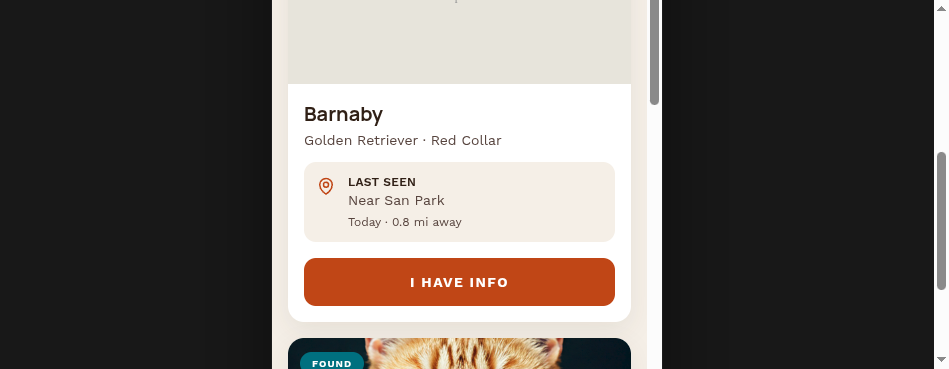
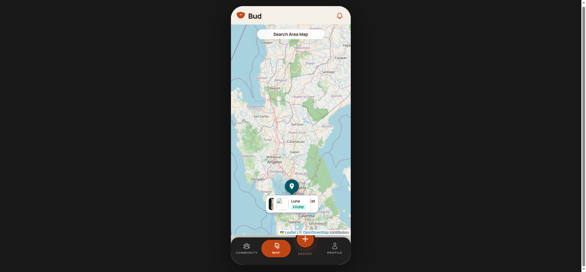
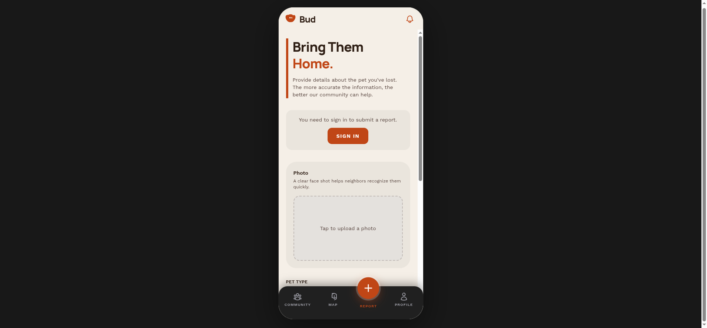
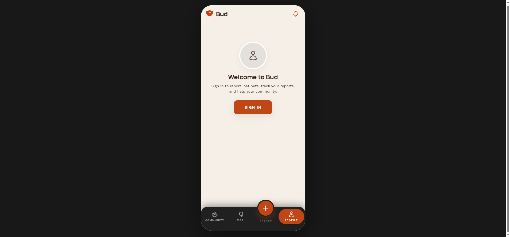
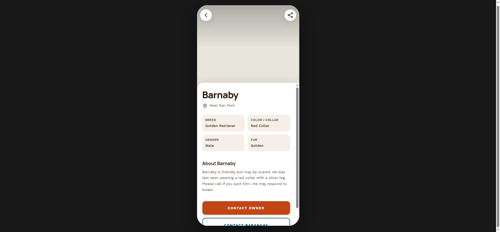
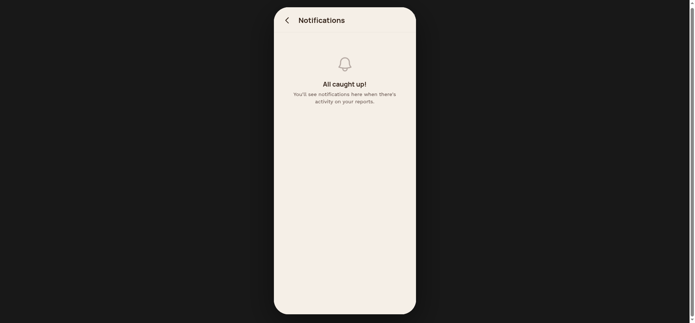

# Bud — Lost Pet Finder

**Bud** is a mobile-first web prototype for reporting lost pets, browsing community sightings, and exploring alerts on an interactive map. It is built as a polished phone-frame experience (React + Vite + TypeScript + Tailwind CSS) with optional **Supabase** backend, **realtime** updates, **offline-aware** queues, and authentication flows.

---

## Demo gallery

Screenshots below were captured from the local dev server using bundled demo pet data (no Supabase required). Files live in [`docs/demo/`](docs/demo/).

### Community board

Browse lost and found listings with search, distance hints, and quick actions.



### Map view

Interactive **Leaflet** map with **OpenStreetMap** tiles and custom markers for each pet (no map API key required).



### Report a lost pet

Structured form flow for reporting a missing animal (sign-in prompts when Supabase auth is enabled).



### Profile

Account entry point: welcome state when signed out, or signed-in profile and pet management when configured.



### Pet detail

Full detail sheet with breed, collar, story text, and contact-style actions.



### Notifications

In-app notification panel with unread badge support when backed by Supabase.



---

## Features

| Area | What it does |
|------|----------------|
| **Community Board** | Scrollable feed of pets with Lost / Found badges, last-seen copy, and **I Have Info** CTAs. |
| **Map** | Pan/zoom map, markers tied to pet coordinates, tap-through to the same pet records. |
| **Report** | Multi-step style reporting UI aligned with the Grounded Guardian / Bud palette. |
| **Profile** | Auth-aware profile shell; ties into reporting and tracking when logged in. |
| **Pet detail** | Overlay with metadata grid, narrative description, share/back chrome. |
| **Notifications** | Header bell with unread count; list UI when opened. |
| **Offline** | Banner plus queued writes via IndexedDB helpers (`offlineQueue`) drained on reconnect. |
| **Data layer** | With Supabase configured: fetch, search, create/update pets, realtime subscriptions. Without it: rich **local demo dataset** in `src/data/pets.ts`. |

---

## Tech stack

- **React 19**, **TypeScript**, **Vite 6**
- **Tailwind CSS** — Bud theme tokens in `tailwind.config.js` (`bud.primary`, `bud.bg`, etc.)
- **Zustand** — `petStore`, `authStore`, `notificationStore`, `uiStore`
- **Supabase** — optional Postgres + Auth + Realtime
- **Leaflet** + **react-leaflet** — map (OSM tiles)
- **react-hot-toast** — lightweight feedback
- **idb-keyval** — offline queue persistence

---

## Quick start

```bash
cd bud
npm install
npm run dev
```

Open the URL Vite prints (typically `http://localhost:5173`). The UI is framed for a phone viewport; widen the browser if you want extra margin around the device chrome.

### Production build

```bash
npm run build    # tsc -b && vite build
npm run preview  # serve the production bundle locally
```

---

## Configuration

### Environment variables

Copy `.env.example` to `.env.local` (or `.env`) and fill in what you need:

| Variable | Purpose |
|----------|---------|
| `VITE_SUPABASE_URL` | Supabase project URL |
| `VITE_SUPABASE_ANON_KEY` | Supabase anonymous key |
| `VITE_GOOGLE_MAPS_API_KEY` | Reserved / legacy; the map uses Leaflet + OSM by default |

If Supabase URL or anon key are missing or still placeholders, the app **falls back to local demo pets** so designers and contributors can run the UI immediately.

### Database setup (optional)

Apply the schema so pets, reports, RLS, and seeds exist:

- **`supabase_schema.sql`** — run in the Supabase SQL editor, or  
- **`supabase/migrations/001_initial_schema.sql`** — if you track migrations in-repo  

Additional nationwide seed data is available in `seed_nationwide_reports.sql` if you want more map density.

---

## Project layout

```
bud/
├── docs/demo/          # README screenshots (see Demo gallery)
├── public/
├── src/
│   ├── components/     # PhoneFrame, BottomNav, OfflineBanner, ErrorBoundary, …
│   ├── screens/        # CommunityBoard, MapView, ReportLostPet, Profile, PetDetail, Auth, Notifications
│   ├── stores/         # Zustand stores
│   ├── lib/            # supabase, api, storage, offlineQueue, networkStatus
│   ├── data/           # DEMO_PETS seed data
│   └── types/
├── supabase/           # SQL migrations
├── index.html
├── vite.config.ts
├── tailwind.config.js
└── package.json
```

---

## Design reference

Visual patterns align with the **Stitch** export `stitch_lost_pet_tracker_map.zip` / **Grounded Guardian** palette (warm paper background, terracotta primary, teal accents). Typography: **Manrope** (headlines) and **Work Sans** (body), loaded via `index.html` / CSS.

---

## Contributing & quality

- Run **`npm run build`** before submitting changes; there is no automated test suite yet.
- Follow existing conventions: two-space indent, double quotes, semicolons, PascalCase components.
- See [`AGENTS.md`](AGENTS.md) for contributor-focused repo guidelines.

---

## License / status

This repository is a **demo / prototype**. Replace demo imagery and copy before any production use; verify privacy, animal-welfare messaging, and regional regulations for real deployments.
