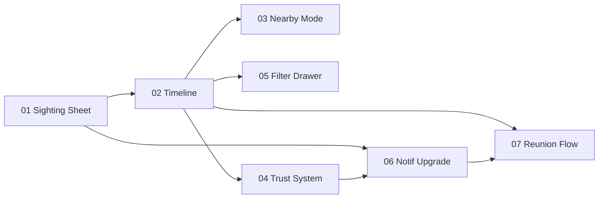

# Bud — Demo Showcase Roadmap

This roadmap defines the **seven hero features** we will build on top of the current Bud prototype. Every feature is **frontend-only**, mocked with **zustand + localStorage**, and tuned for a **live demo showcase** — meaning each one has a 15-second "wow" moment.

> If you only read one thing in this folder, read **Design Language** below. It locks every color, easing, and bubble effect we will reuse across the seven sub-plans so the app feels like one product, not seven tech demos stitched together.

---

## How to use this folder

- **`ROADMAP.md`** (this file) — master index, shared design language, build order.
- **`roadmap/01–07-*.md`** — one deep sub-plan per hero feature. Each sub-plan is **self-contained** and follows the same template (TL;DR → Roast it kills → Where it lives → Feeling → UI anatomy → Motion choreography → State & logic → Demo script → Files touched → Edge cases → Build sequence).
- The sub-plans are written to be **picked up cold** by any developer, with no need to re-read the others.

---

## Design Language (locked)

### Color tokens (no new tokens — reuse what is in [`src/styles/tokens.ts`](src/styles/tokens.ts) and [`tailwind.config.js`](tailwind.config.js))

| Role | Token / class | Hex |
|---|---|---|
| Canvas | `bg-bud-bg` | `#F0EBE3` |
| Card | `bg-bud-card` | `#FFFFFF` |
| Surface (recessed) | `bg-bud-surface-low` | `#ebe6de` |
| Input well | `bg-bud-surface-well` | `#e5e2de` |
| **Primary CTA** | `bg-bud-primary` | `#8B3A15` (terracotta) |
| Primary hover | `bg-bud-primary-dim` | `#723012` |
| **Accent** | `text-bud-accent` / `bg-bud-accent` | `#005763` (deep teal) |
| Accent container | `bg-bud-accent-container` | `#007180` |
| Text | `text-bud-text` | `#2C1A0E` |
| Text muted | `text-bud-text-muted` | `#56423c` |

### Status colors (locked from the earlier status pass — **do not deviate**)

| Status | Pill class | Text |
|---|---|---|
| LOST | `bg-red-600 text-white` | `text-xs font-bold uppercase tracking-wide` |
| FOUND | `bg-green-600 text-white` | same |
| REUNITED | `bg-blue-500 text-white` | same |
| SIGHTED (timeline + map density) | `bg-yellow-500 text-white` | same |

### Motion primitives (we will extend [`src/index.css`](src/index.css))

Every sub-plan picks from this short menu. **No bespoke animations per feature** — if a new feeling is needed, we add a primitive here first.

| Primitive | Purpose | Duration | Easing |
|---|---|---|---|
| `bud-bubble-rise` | small circular blob floats up + fades (submit, success, idle ambience) | 1400–2200ms | `cubic-bezier(.2,.65,.2,1)` |
| `bud-ripple` | expanding ring for "new event / tap landed" | 700ms | `cubic-bezier(.16,.84,.44,1)` |
| `bud-pop-in` | spring scale 0.92 → 1 with overshoot 1.03 (cards, toasts, chips on select) | 320ms | `cubic-bezier(.34,1.56,.64,1)` |
| `bud-shimmer` | diagonal gloss sweep (trust badges, share cards) | 2.4s loop | linear |
| `bud-radar` | rotating gradient sweep (map nearby mode) | 3.2s loop | linear |
| `bud-confetti-burst` | 24 particles (paw + bubble + heart) shoot outward then fall | 1800ms | `cubic-bezier(.2,.7,.3,1)` |
| `bud-roll-digit` | vertical translate of a digit reel (count rolls) | 420ms per digit | `cubic-bezier(.4,0,.2,1)` |
| `bud-breathing` | scale 1 → 1.04 → 1 + opacity 0.8 → 1 (unread badge, hot cluster) | 2.2s loop | `ease-in-out` |

**Rule:** every primitive is gated by `motion-safe:` so `prefers-reduced-motion: reduce` users get a static fallback (opacity fade only).

### Bubble effect language

Bubbles are **the** visual signature for Bud. They appear in:

- Background ambience (`AppBubbleBackground`, already shipped).
- Submit / success moments (rising trail, primary + accent colors at 0.18–0.32 alpha).
- Empty states (one or two big floating bubbles with a paw glyph inside).
- Trust auras (a single soft bubble behind the avatar).
- Map density (semi-transparent bubbles at pet clusters).

Bubble physics: blurred (`blur-2xl` to `blur-3xl`), `rounded-full`, alpha 0.10–0.35, sizes between 24px and 240px. Never solid, never sharp-edged — they are atmosphere, not UI.

### Typography & rhythm

- Headlines: `font-headline` (Manrope), `font-extrabold`.
- Body: `font-body` (Work Sans).
- Status / meta: `text-xs font-bold uppercase tracking-wide`.
- Vertical rhythm in cards: 12 / 16 / 24 (gap-3, gap-4, gap-6 in Tailwind).

### Accessibility floor

- Every overlay has a focus trap + visible focus ring (`focus-visible:ring-2 focus-visible:ring-bud-primary/40`).
- Color is **never** the only signal — status pills also carry text labels.
- `aria-live="polite"` on the rolling notification badge.
- All particle bursts respect reduced motion.

---

## The seven hero features

| # | Feature | Sub-plan | Kills (from the roast) |
|---|---|---|---|
| 01 | Sighting Submission Sheet | [`roadmap/01-sighting-sheet.md`](roadmap/01-sighting-sheet.md) | `window.prompt` for "I Have Info" |
| 02 | Pet Activity Timeline | [`roadmap/02-pet-timeline.md`](roadmap/02-pet-timeline.md) | No owner narrative / no history |
| 03 | Map Nearby Mode | [`roadmap/03-map-nearby.md`](roadmap/03-map-nearby.md) | Map is toy, "nearby" is just a word |
| 04 | Trust & Verified Neighbor | [`roadmap/04-trust-system.md`](roadmap/04-trust-system.md) | Trust assumed, never earned |
| 05 | Smart Filter Drawer | [`roadmap/05-filter-drawer.md`](roadmap/05-filter-drawer.md) | Search is a single text input |
| 06 | Notification Center Upgrade | [`roadmap/06-notification-upgrade.md`](roadmap/06-notification-upgrade.md) | Notifications are a flat list |
| 07 | Reunion Celebration Flow | [`roadmap/07-reunion-flow.md`](roadmap/07-reunion-flow.md) | Reunion has no payoff |

---

## Build order

We ship in the order shown above. Reasoning:

1. **01 first** — the most embarrassing thing in the app right now is the `window.prompt`. Fixing it unlocks real sighting data, which **02, 03, and 06** all consume.
2. **02 next** — the Pet Detail page becomes the spine of every demo path; we need it strong before adding more entry points.
3. **03 and 05** are independent and can be parallelized once **02** is in.
4. **04** is mostly cross-cutting className additions plus a tiny derived selector — slot it in after 02.
5. **06** depends on **01** (sightings) and **04** (trust badges in notifs).
6. **07** is the closer — it depends on **02** (timeline shows the reunion entry).

---

## Mocked vs Wired

Everything is **frontend-only**. No Supabase migrations, no new env vars, no auth changes.

| Concern | Approach |
|---|---|
| Sightings storage | `useSightingStore` (zustand + `persist`) — keyed by `petId` |
| Trust counters | derived from `useSightingStore` + `useAuthStore.profile` |
| Notifications | mocked seed in `useNotificationStore` + push from sighting submissions |
| Reunion stats | derived selectors on the existing `usePetStore` + `useSightingStore` |
| Share card | rendered to a hidden canvas via `html-to-image` (or fallback: styled DOM screenshot prompt) |
| Map user position | hard-coded mock LatLng in `useUiStore` (Manila default) |

---

## Out of scope (explicit)

- No new routes — every feature mounts inside the existing routes documented in [`APP_PAGES.md`](APP_PAGES.md).
- No new color tokens — only the existing `bud.*` palette plus the locked status colors.
- No backend, no Supabase schema changes, no RLS work, no auth flow changes.
- No tests added (matches the current stance in [`AGENTS.md`](AGENTS.md)). We rely on `npm run build` for the TypeScript safety net.
- No new fonts. Manrope + Work Sans only.

---

## Definition of "demo ready" (applies to every sub-plan)

A feature is demo-ready when **all** of these are true:

1. **Cold start works** — close the tab, reopen, and the seeded state still produces a meaningful demo.
2. **15-second wow path** lands without the presenter explaining what to look at.
3. **Reduced motion** still tells the story (no feature is *only* legible with animation).
4. **Phone frame** (max 430px) — every interaction tested inside `PhoneFrame`.
5. **No console errors**, no TypeScript errors (`npm run build` green).
6. **Sub-plan markdown** is updated with any deviations made during the build.
